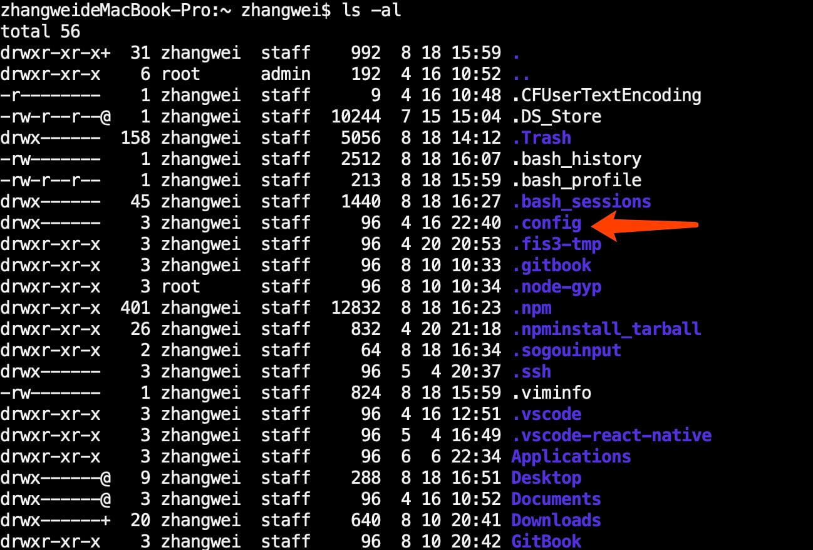

## 介绍使用Mac中遇到的一些问题和一些小技巧，希望能够对大家有所帮助😀😄

1、Mac中普通用户和root用户之间切换
```bash
sudo -i   //普通用户切换至root用户
exit      //root用户切换至普通用户
```

2、git中，使用git add . ，提示报错，`warning: unable to access '/Users/macUsername/.config/git/attributes': Permission denied`

`原因：`.config文件读写权限不够

`解决方案：`

（1）切换到`.config`文件所在目录，使用`ls -al`命令查看`.config`文件权限信息，如下图所示



（2）使用`sudo chown macUsername .config`命令即可添加用户读写权限，上图中的`.config`文件已获得权限

